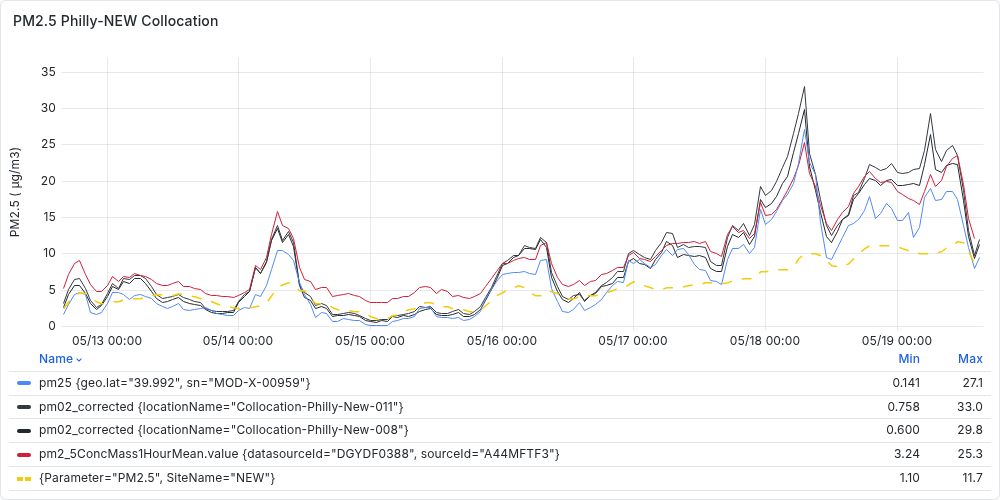
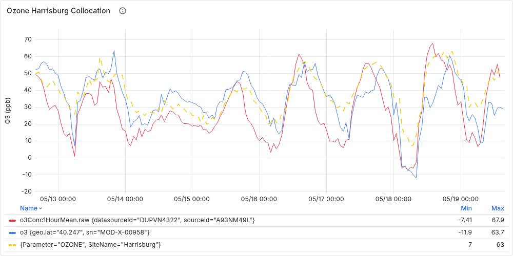

# Air Quality Monitoring in Harrisburg and Philadelphia
Variation of air pollution in time and space in the US is mainly tracked through EPA monitors. 
However these monitors tend to be too expensive and bulk in size, hence it's difficult to have them in as many places as desired. This results in incomplete geospatial representation of the variation in in air pollution. 
In this project we use low-cost sensors in the urban areas of Harrisburg Philadelphia in Pennsylvania to understand the geospatial variation of the air pollution in these urban centers relative to the data from EPA monitors.  
To do this, three device types (categorized based on manufacturers) that is AirGradeint, QuantAQ and Clarity are evaluated in relation to the data from epa monitors, correction factors are applied to the data from these devices to bring their values closer to those by EPA monitors. The process of finding the errors and correction factors is known as collocation. 

## 1. Collocation 
Below we display a sample collocation graph for the Philadelphia North East West and Philadelphia Montgomery site. 

Another sample collocation for Ozone on the Harrisburg Department of Environmental Protection site 

